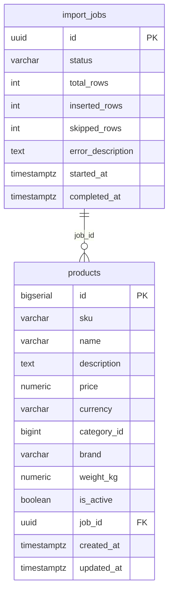

# Entity Model

**Version:** v1.0.0

Two tables support the CSV import pipeline.

## Entities

| Entity | File | Description |
|---|---|---|
| `import_jobs` | [import-jobs.md](import-jobs.md) | Tracks each CSV import run — status, progress counters, and error info |
| `products` | [products.md](products.md) | The product catalogue rows loaded by each import job |
